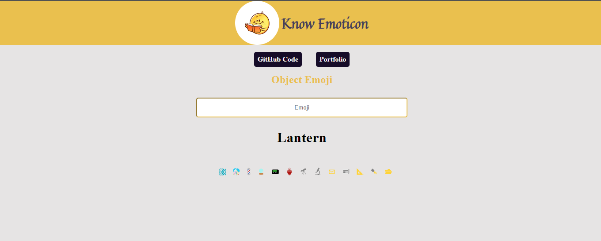

# Know Emoticon

This is React based simple App which takes the emoji as an input from the given emojis and output its name.

## [LIVE](https://knowemoticon.netlify.app/)

---

---

## Technologies

- React

---

Contact :

- [Twitter](https://twitter.com/Vanshsh2701)
- [Linkedin](https://www.linkedin.com/in/vanshsharma27/)
